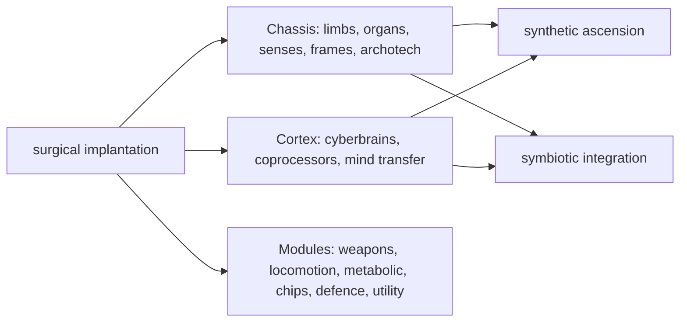

# Cybernetics Changes

The design behind the Cybernetics Overhaul and its research tree: why they exist, how the tree is
shaped, and how a dozen implant mods are pulled into one system. This is the reasoning; the per-toggle
summary is in `Documentation.md`. Every part is a separate settings toggle, and each only touches the
mods it needs, so a smaller implant modlist gets the part of the overhaul that fits it.

## The problem

A large implant modlist is a pile of overlapping systems. Core, Royalty, Biotech, EPOE-Forked,
Integrated Implants, GiTS Cyberbrains, Psychic Implants and Altered Carbon each ship their own research
tab and their own idea of how a colony should progress. The tabs repeat each other, a single research
often hands over a whole tier at once, and the same tier word means different things in different mods.
Prices collide as well: two implants doing the same job can cost very different amounts depending only
on which mod authored them.

The overhaul answers this in two halves, each its own settings group. **Cybernetics Overhaul** reshapes
the content: what implants are, how they host each other, and what they cost. **Cybernetics Research
Overhaul** reshapes how you unlock it.

## One tab, one surgery to operate

The separate implant research tabs are consolidated into a single **Cybernetics** tab, rooted on one
cheap early research, *surgical implantation*, that all implant surgery then answers to. Once a colony
can operate it can fit anything it gets hold of, whether crafted, traded or won. What a colony can
*build* is staged across the rest of the tab.

## Three branches, a tier at a time

The tab is organised into three branches that read as a clear progression rather than a wall of
parallel unlocks:

- **Chassis** rebuilds the body: crude prosthetics and surrogate organs first, then bionic limbs,
  organs and senses as separate unlocks, then the advanced tiers, the thoracic frames that replace the
  ribcage, and the archotech limbs. at the top
- **Cortex** rebuilds the mind: cyberbrains and their coprocessors on one side, and the mind-transfer
  line on the other (recording a mind, growing a sleeve, resleeving, remote casting, editing).
- **Modules** are the hardware that plugs into the chassis and cortex: integral melee and ranged
  weapons, locomotion, metabolic and environmental systems, skill chips, defensive and utility gear,
  and a top ultratech weapon tier.

Splitting the old one-research-per-tier unlocks into these lanes means a colony equipping a work crew
and one equipping soldiers no longer research the same thing, and neither waits on a single project that
hands over everything at once.

## Implants that host implants

The overhaul draws a line between a **part** and a **module**. A part replaces a body part; a module
adds a capability, and instead of being fitted on its own it plugs into a slot on a host already
installed in the pawn. Cognitive modules go into a cyberbrain, torso modules into a thoracic frame, limbs modules on limbs, etc. How
many a pawn can carry depends on the tier of the hosts it paid for, not on how many implants exist. This
turns "install every buff in the game" into a real chassis-building decision, and gives the frames and
cyberbrains a purpose beyond their own stats. It is also what lets bolt-on implants from Integrated
Implants, EPOE-Forked and Psychic Implants share one slot system instead of stacking without limit.

## Cyberbrains from rival manufacturers

Cyberbrains are the most content-dense corner of the tree, so they carry the most structure. Rather
than one ladder where every specialization arrives at once, they are organised into three manufacturers,
each with its own character, tiers and flagship:

- **Civis**, a glitterworld consumer house, sells labour capability: one model per trade, then advanced
  two-trade models, then a generalist flagship.
- **Aegis**, a military contractor, sells combat capability as variants rather than upgrades.
- **Echo**, a quieter psychic house, sells cyberbrains and hardware tuned to the psychic architecture of
  the mind, and lives in the Cortex branch's mind lanes.

Each model is named for what it does, so the line can be navigated by intent (what should this colonist
be good at) rather than read as a flat list of factory codes.

## Two endings, pulling opposite ways

The tree ends in two capstone researches that share a prerequisite and offer opposite goals, so a long
cybernetics game has something to build toward instead of trailing off:

- **Synthetic ascension** rebuilds a living pawn as an android. It buys freedom from biology: no
  disease, no ageing, nothing to wear down. The cost is everything biology was doing for you, and it is
  a real production chain to reach, not a single click.
- **Symbiotic integration** goes the other way, growing a frame that only works in living tissue and an
  implant that gives more the further a body has already been engineered from its baseline. It is the
  endgame for a colony that stayed flesh.

Both sit at the far end of the tab, behind whichever of the archotech chassis and mind-transfer lanes
the modlist has, so they land where the tree's two halves meet and a colony can credibly go either way.

## One ladder for effect and price

Underneath the tree, a separate pass puts artificial body parts from every loaded mod on a single
ladder of effect, so a tier means the same thing wherever you meet it, and sets each part's price by
what it actually does. This is what lets parts from Core, Royalty, Biotech, EPOE-Forked, Integrated
Implants, GiTS, Psychic Implants and Big and Small sit in one tree without a colony being able to buy a
stronger implant for less than a weaker one. A shared crafting material, the micromachine, runs under
the advanced tiers so the deeper parts of every branch draw on one component made at your own bench.

## Clearing up after itself

Because the tab absorbs the research the individual mods shipped, a retire pass deletes the original
projects it took over, so the old tabs empty out instead of offering the same unlocks twice. Projects
that another mod's code needs to exist are moved onto the tab rather than deleted, and research that was
never part of this overhaul is left alone. Turn a lane off and the research it would have replaced is
left where it is, so a partial configuration is safe rather than broken.
