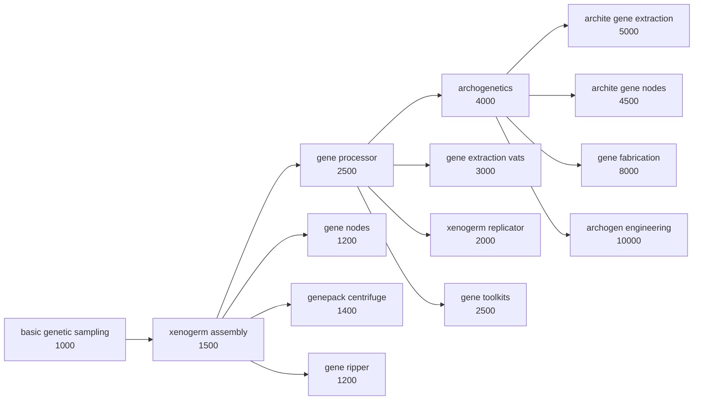

# Rebalance Patches — Feature Documentation

What every toggle in the mod settings does, grouped the same way as the settings window. Every feature can be turned off individually (restart required), and every feature silently does nothing if the mods it targets aren't loaded.

---

## Patches

### RimIOT - Logistic Matrix

- **Cheaper builds** (`rimiot.costs`) — Cables, input connectors and interfaces cost a little steel and regular components instead of advanced ones. Passive logistics infrastructure leadin to performance gain on hauling shouldn't be an endgame investment.
- **No power consumption** (`rimiot.power`) — Network buildings no longer draw power or need wiring, and their descriptions are rewritten to match.

### Altered Carbon

- **Disable VAE ranged shield belt** (`altered.shieldbelt`) — Vanilla Apparel Expanded - Accessories' ranged shield belt is a cheaper duplicate of Altered Carbon's cuirassier belt, so it becomes uncraftable, untradeable and stops spawning; the harder-to-get AC version stays. Existing belts keep working.
- **Casting relay range slider** (`altered.relayrange`, slider 1–25, default 10) — Choose how many world tiles of needlecasting range each powered casting relay adds; I find Altered Carbon's fixed 5 is too short. Toggle off to keep the original behaviour.
- **Advanced shields need Fabrication** (`altered.shieldsfab`) — The advanced shield belt research additionally requires Fabrication; its gear is fabrication-bench only anyway.
- **Cuirassier belt on vanilla shields** (`altered.cuirassier`) — The cuirassier belt uses the vanilla shield mechanic instead of the shield bubble: it scales with quality and doesn't block your own shots.
- **Neural editor trait blacklist** (`altered.traitblacklist`) — Body-bound traits from Hauts' Added Traits, The Sims Traits and Vanilla Traits Expanded no longer carry between sleeves.
- **Sleeve quality cancer rates fixed** (`altered.sleevecancer`) — Good-to-legendary sleeve quality genes accidentally *inverted* their cancer-rate stat; they now properly reduce it (90% down to 50%), while awful and poor sleeves keep their increased rates.

### GiTS Cyberbrains

- **Only basic cyberbrains sold** (`gits.merchant`) — Traders no longer stock the enhanced, specialized, advanced or extreme tiers, so buying a top-tier brain can't skip the progression. They stay craftable and can spawn on raiders.
- **Harsher extreme mental break** (`gits.mentalbreak`) — The PX-7 and HADES cyberbrains' mental break threshold penalty doubles from +20% to +40%.
- **Streamlined research tree** (`gits.research`) — The three nanite surgery researches collapse into one, empty filler nodes are deleted and prerequisites are rewired; no more one-recipe padding.
- **Surgeries via EPOE, ultratech tiers** (`gits.surgeries`) — Cyberbrain surgery unlocks with EPOE-Forked's Brain Surgery research, and everything past the basic cyberbrain moves to ultratech, integrating GiTS into the EPOE surgery progression and pushing the crazy tiers to endgame. Needs EPOE-Forked; does nothing without it.

### Odyssey

- **Long-range passenger shuttle** (`odyssey.shuttle`) — Chemfuel capacity 400 → 2000 and cargo capacity 500 → 2000 kg. The stock shuttle barely leaves the neighbourhood and I don't want to install modded shuttles.
- **Vacuum resistance trims on modded armor** (`odyssey.vacuumtrims`) — Only active with Vanilla Gravship Expanded - Chapter 1, whose balance assumes 100% vacuum resistance is hard to reach — while modded spacer armor hands it out freely. Helmets and suits from Rimsenal (Core and Federation), Altered Carbon 2, Spacer Arsenal and Impact Weaponry - Reloaded get their vacuum resistance trimmed a few points below the cap, with a couple of description fixes so items advertise what they actually do.

### Gene conflict fixes (`geneconflicts.*`)

Genes whose forced traits fight each other, or whose bonuses stack brokenly across mods, become mutually exclusive:

- **`geneconflicts.bloodlust`** — Big and Small's bloodlust and VRE - Highmate's distressed force traits that suppress each other and bug out when combined.
- **`geneconflicts.psychic`** — WVC's psychic UV/dark sensitivity genes can't combine with the vanilla psychically dull and deaf genes they fight.
- **`geneconflicts.firefoam`** — WVC's firefoam pop (suppresses Pyromaniac) vs Alpha Genes' fire obsession (forces it).
- **`geneconflicts.hemogen`** — Hemogen drain genes from vanilla, Big and Small and WVC can no longer stack with VRE - Sanguophage's.
- **`geneconflicts.deathless`** — Deathless-type genes (vanilla deathless, Big and Small's revenant soul and immortal return, WVC's undead and never dead, VRE - Archon's transcendent) can't be combined on one pawn.
- **`geneconflicts.dodge`** — Melee dodge genes from VQE - Ancients, Rimsenal Harana, Rimsenal Askbarn, Det's Keshig and Highborn Xenotype share VRE - Lycanthrope's dodge exclusion, so dodge bonuses can't stack across mods.
- **`geneconflicts.claws`** — Innate claw and talon attack genes can't stack: Alpha Genes' clawed hands, crab claw and pneumatic claw, WVC's kitty and archite claws, Big and Small's venom talons, VRE - Saurid's claws, VRE - Sanguophage's talons, VRE - Insector's charger claws and VQE - Ancients' plasteel claws.
- **`geneconflicts.bleedrate`** — Big and Small's slow bleeding vs VRE - Genie's hemophiliac; the two pull bleed rate in opposite directions.
- **`geneconflicts.flirty`** — VRE - Highmate's flirty vs Big and Small's never flirts.
- **`geneconflicts.meleespeed`** — Det's Brawnum's slow hitter joins VRE - Archon's melee attack speed exclusion, so melee speed genes can't stack across the two mods.

### Alpha Genes

- **Genes in vanilla genepacks** (`alphagenes.genepacks`) — Alpha Genes normally keeps its genes out of vanilla genepacks; this lets them spawn there at sane rates (cosmetics much rarer), makes alphapacks and mixedpacks unobtainable (existing ones keep working), and the gene-lab quest spawner yields vanilla genepacks only.
- **Rename angelic beauty** (`alphagenes.beautyrename`) — With WVC loaded, Alpha Genes' "angelic beauty" is relabeled *uncanny beauty* so it can't be confused with WVC's "angel beauty". Label only.

### Big and Small / VFE / VRE

- **`bigsmall.madscience`** — Mad science requires the Gun turrets research (instead of every turret it unlocks requiring Gun turrets individually, which also displayed wrong).
- **`bigsmall.geneintegrator`** — The gene integrator — it turns all xenogenes into endogenes, freeing the slots to stack more — moves to the archite research tier, costs an archite capsule plus ultratech materials, and gets a real market value.
- **`vfepirates.chargeweapons`** — Warcasket charge weapon boxes require pulse-charged munitions research (the railgun needs Mass Drivers with Coilguns loaded); the same gates apply to Warcasket Weapon Quality's direct-craft recipes.
- **`vfepirates.empirescenario`** — The Empire is no longer permanently hostile to the pirate scenario faction, so the Low orbit crash scenario's reputation can be repaired (Royalty).
- **`vfeempire.qol`** — The royal armchair counts for Stellarch throne rooms; the candelabra shows its glow radius when placing.
- **`vreinsector.colossalweapons`** — VRE - Insector's colossal insectors can wield Big and Small's giant weapons.

### Rimsenal

- **`rimsenal.armortechs`** — Rimsenal armors unlock from their matching corp techs instead of the generic Recon/Marine/Powered armor researches (sets that had no research at all get one).
- **`rimsenal.modularweapons`** — The modular carbine, its conversion kit and the MBPS armor kit move behind the corp defence tech; the GD multi launcher also needs Mortars.
- **`rimsenal.corpcost`** — Tier-1 corp techs cost 3000 research.
- **`rimsenalspacer.caravanmechs`** — Rimsenal Spacer trade caravans no longer bring mechanoid guards (their caravan generation was broken).
- **`rimsenalspacer.smartweapons`** — Smart weapons drop their redundant gunsmithing prerequisite, and the smart visor unlocks from the renamed *smart targeting systems* research.

### Memes, xenotypes & inspirations

- **Inspirations respect precepts** (`memes.inspirations`) — Inspirations no longer roll on pawns whose ideology forbids the activity: shooting/melee frenzies respect violence precepts, taming respects ranching, recreation-type inspirations respect joy precepts, and so on — including Vanilla Social Interactions Expanded's frenzies (Ideology).
- **`memes.factions`** — Warlike Rimsenal factions can't roll Alpha Memes' vow of nonviolence, which broke their combat pawns.
- **`memes.anomalytraits`** — The Occultist trait and void fascination agree with the Inhuman and Ritualist memes (Anomaly).
- **`xenotypes.factions`** — Odyssey's Salvagers gain fitting modded xenotypes (Zohar, Askbarn, Uredd, Harana, Venator, Keshig, Fleetkind), the Traders guild gains Fleetkind, and WVC's Mechakin, Rogueformer and Genethrower move to Rimsenal Spacer factions.
- **`xenotypes.wvcchances`** — WVC's oddball xenotypes (Featherdust, Cat deity, Blank, Sandycat, Undead) leave the generic vanilla factions; Undead and Sandycat join the Horax cult (Anomaly).

### Integrated Implants

- **`implants.chipbad`** — Skill chips are no longer treated as ailments, so healer serums and biosculpting don't remove them.
- **`implants.chiptiers`** — The mechanitor implants (mechhive satellite uplink, mechwomb, warprogrammer interface, remote dominator) cost Alpha Mechs' high-tier chips instead of cheap ones.
- **`implants.voicelockmasochist`** — Masochists enjoy being voicelocked (+8 mood instead of -8).
- **`implants.shoulderslimes`** — Shoulder turrets install on the shoulder instead of the torso, which slime and robot bodies don't have (fixes errors with Big and Small - Slimes).
- **Levitating implants ignore water** (`implants.waterpathing`) — Pawns with the psychic levitator or gravlifter float over water instead of wading.
- **Signal boosters stack with AG command range genes** (`implants.boosterrange`) — Alpha Genes' command range genes used to override Integrated Implants' signal boosters entirely; now the gene sets the base range and boosters extend it, with the command ring drawn correctly. Needs both mods.

### Weapons & apparel

- **`vse.reloadingstat`** — Vanilla Skills Expanded's gunner expertise modifies the vanilla ranged cooldown stat, so its bonus shows on weapon stat cards.
- **`impactweaponry.bolterprereq`** — The warcasket impact bolter needs spacer warcasket weaponry plus impact shot, dropping a redundant extra prerequisite.
- **`spacerarsenal.prereqs`** — Spacer Arsenal's heavy weapons unlock from Vanilla Weapons Expanded's Heavy Weapons + Fabrication; the coil weapons from Mass Drivers (Coilguns).
- **`eltex.spawns`** — Eltex weapons stop spawning on random raiders and appear where they belong: Empire cataphracts, psycasters and deserters (Royalty).
- **`alphamemes.vacstonetiles`** — Alpha Memes' styled tiles can be built from Odyssey's vacstone blocks.

### Vanilla & DLC

- **`vanilla.healingenhancer`** — The Royalty healing enhancer uses the visible injury healing stat instead of a hidden one, so its effect shows on the pawn's stat card.
- **`vanilla.mechraidgroups`** — Mechanoid raids come in combined compositions mixing vanilla, Alpha Mechs and Rimsenal Spacer mechs.
- **`vanilla.toxicmeat`** — VAE Waste's toxic meat is unchecked by default in hoppers and meal recipes.
- **`vanilla.creepjoinersurgery`** — Creep joiners accept every surgery a regular human can get, including modded implants and prosthetics (Anomaly).
- **Gene complexity sliders** (`vanilla.genecomplexitybase`, `vanilla.genecomplexityprocessor`) — Two sliders: extra base gene complexity for the gene assembler (default +10), and complexity per gene processor (default 3, vanilla 2). Toggling either off keeps the vanilla value.

### VQE Ancients

- **`vqea.sittable`** — The ancient hospital armchair and bench become actual seats.
- **`vqea.giantweapons`** — The Enormous and Herculean archite genes let their carriers wield Big and Small's giant weapons.
- **`vqea.patientgown`** — The patient gown's blunt armor drops from 0.5 to 0.1, so pawns stop preferring it over real armor.
- **Archogen injector whitelist** (`vqea.injectorwhitelist`) — The archogen injector and ancient-experiment pawns normally roll from *every* loaded archite and negative gene — absurd with a large modlist, including pawn-ruining drawbacks. They now roll from a curated list: VQE - Ancients' own archite powers plus mild drawbacks from vanilla and the major gene mods.

---

## Genepool Cleanup

With every gene mod loaded the genepool holds hundreds of genes, dozens of which do the same thing under different names. This module keeps one canonical gene per function, removes the duplicates, and rewires every xenotype that carried a duplicate to the canonical version — races keep their identity through shared genes. Removals run through **Cherry Picker** (a mod dependency) automatically, with no Cherry Picker setup needed; toggling a setting off restores its genes on the next restart. Only active when Alpha Genes, WVC - Xenotypes and Genes and Big and Small - Genes & More are all loaded (except the Hussar aptitudes toggle, which needs only VRE - Hussar). The full list of removed genes, replacements and xenotype changes is in `Docs/GeneChanges.md`.

- **`genepool.agsummons`** — Removes Alpha Genes' animal summon family (~90 genes, one per supported animal). No xenotype uses them; they only dilute the pool and I don't like them.
- **`genepool.wvcdupes`** — Removes WVC genes that duplicate vanilla Biotech genes or WVC's own alternatives (~50). WVC xenotypes get the surviving equivalent instead.
- **`genepool.bsdupes`** — Removes Big and Small's three gene stabilizing genes (balance, no replacement) and the deathlike body gene (undead xenotypes get unstable deathlessness instead).
- **`genepool.dedup`** — The cross-mod deduplication: Alpha Genes keeps immunities, natural armor, bandwidth, pack mule and the like; Big and Small keeps body size, gender, no pain and healing speed; each specialist VRE race pack keeps its specialty; Det's packs keep their signature quirks; WVC's archite-tier uniques win over everyone's natural versions. Duplicates whose canonical mod is missing are left alone.
- **`genepool.hussaraptitudes`** — VRE - Hussar generates one weapon-aptitude gene per craftable weapon (~300 with a large modlist). They're replaced by four category genes — light and heavy melee aptitude, light and heavy ranged aptitude (heavy = 3 kg and up) — with the same bonus and cost. The hussar xenotypes still get a random aptitude; with Gene Nodes - Genes for Sale, a new archite gene node delivers the four genes. Pawns from older saves that carried a per-weapon aptitude lose it with a one-time load warning.

## Xenotype Gene Integration

Small thematic gene additions to individual xenotypes, drawing on the cleaned-up genepool. Each toggle needs the xenotype's mod plus the gene's mod, and does nothing when either is missing.

- **`xenotypes.boglegwater`** — Boglegs gain water striding (Alpha Genes): no movement penalty in watery terrain.
- **`xenotypes.stonebornskin`** — Det's Stoneborn gain stoneskin (WVC - Xenotypes and Genes): stone-covered bodies with natural armor and very low flammability, at a metabolism cost. Their appearance changes to stone-like skin.
- **`xenotypes.neanderthalfrost`** — Neanderthals gain frostbite resistance (Alpha Genes): frostbite damage halved.
- **`xenotypes.wvcspawns`** — WVC - Xenotypes and Genes' most powerful races (ferrkind, metalkin, rustkind, deadcat) no longer spawn as random wanderers, refugees, beggars or faction pawns. They remain obtainable through WVC's own events, morphs and implanters, like the rest of its top tier.

## Genetics Research Overhaul

A cohesive rework of genetics research: vanilla puts a full gene-editing empire behind two cheap industrial researches; this stages it from basic sampling to archogenetics and gives every genetics mod a common backbone. Requires **Biotech**; every module has its own toggle and does nothing if its target mod is missing.

### The tree

All projects sit on a new **Genetics** research tab, at spacer tech, on the hi-tech research bench. Costs escalate down the tree.

### Core tree (`genetics.core`)

Creates the Genetics tab rooted on a new *basic genetic sampling* project (gene extractor and gene bank unlock there), renames Xenogermination to *xenogerm assembly*, and moves the gene processor and archogenetics onto the tab with raised costs. Third-party gene buildings automatically default to the sampling unlock.

### ReSplice: Core (`genetics.resplice`)

The gene centrifuge and xenogerm duplicator become deliberate unlocks behind new *genepack centrifuge* and *xenogerm replicator* projects, renamed to match.

### Gene Extractor Tiers (`genetics.extractortiers`)

The gene extraction vat becomes a mid-tree unlock and the two archite vats a late-tree one, so extraction stops being trivialised the moment basic xenogenetics finishes.

### Gene nodes (`genetics.genenodes`)

Base gene nodes get their own project after xenogerm assembly. Archite node libraries are effectively free archite genepacks, so every archite node — including the premium Ageless and Sanguophage tiers — moves behind *archite gene nodes* with real prices (more components, archite capsules, silver); nodes that shipped their own bargain prices now use the tier prices.

### Gene Ripper (`genetics.generipper`)

A kill-to-extract a specific gene machine shouldn't share the plain extractor's unlock: it moves behind its own *gene ripper* project.

### Gene Fabrication (`genetics.genefab`)

Fabricating genes from neutroamine is an end-of-tree power, not a gene-processor side grab: the research becomes an archogenetics capstone (cost 8000).

### VQE Ancients archogen lab (`genetics.vqea`)

A new *archogen engineering* capstone (10000, multianalyzer) lets you build the archogen injector and its 12 linkable lab facilities yourself at archite-tier costs — raiding ancient vaults stays the shortcut, research the long road.

### Alpha Genes gene toolkits (`genetics.agtools`)

Alpha Genes' eleven single-use gene tools normally come from traders and quest rewards only. A new *gene toolkits* project makes them all craftable at the fabrication bench, with costs scaling from genepack tweakers up to the archotech variants (which need an archite capsule). Trade acquisition is untouched.

### Alpha Genes quest flavour (`genetics.alphagenes`)

The abandoned biotech lab quest is renamed to xenogenetics-lab flavour matching the overhauled genetics theme.
