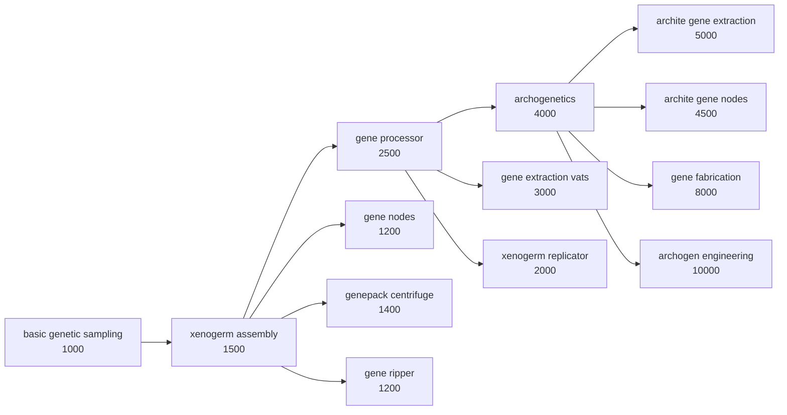

# Rebalance Patches — Patch Documentation

> **⚠ Keep this document up to date: every time a patch is added, removed or meaningfully changed, update this file (and CHANGELOG.md) in the same commit.**

This is the internal reference for every patch the mod ships. Steam-facing text lives in About.xml and the workshop description; this file is for tracking what each patch does, to which mods, and why.

---

## Standalone patches

### RimIOT - Logistic Matrix

Affects: **RimIOT - Logistic Matrix** (`CN.RimIOT`) — folder `1.6/RimIOT`.

- **Cheaper builds** (`rimiot.costs`) — Rewrites the cost lists of the cable, input connector and interface: a few steel, industrial components instead of advanced ones.
  *Why:* RimIOT is quality-of-life logistics; advanced-component prices made passive infrastructure feel like an endgame investment.
- **No power consumption** (`rimiot.power`) — Strips the power and flickable comps from the network buildings.
  *Why:* removes wiring/power micromanagement from something that should just work in the background.

### Altered Carbon

Affects: **Altered Carbon** (`hlx.UltratechAlteredCarbon`) + **Vanilla Apparel Expanded — Accessories** (`VanillaExpanded.VAEAccessories`) — folder `1.6/AlteredCarbon`.

- **Disable VAE ranged shield belt** (`altered.shieldbelt`) — Makes the VAE Accessories ranged shield belt uncraftable, untradeable and unspawnable. The def is kept so saves are unaffected. Guarded: does nothing if VAE Accessories isn't loaded.
  *Why:* it's a cheaper duplicate of Altered Carbon's cuirassier belt; removing it keeps the harder-to-get AC version meaningful.

### GiTS Cyberbrains

Affects: **GiTS: Cyberbrains** (`moistestWhale.gitsCyberbrains`) + optionally **EPOE-Forked** (`vat.epoeforked`) and **VE Achievements** (`vanillaexpanded.achievements`) — folder `1.6/GiTS`.

- **Only basic cyberbrains sold** (`gits.merchant`) — Empties the trade tags of the enhanced/specialized/advanced/extreme cyberbrain tiers. They stay craftable and can spawn on raiders.
  *Why:* buying top-tier brains off a trader skips the whole progression.
- **Harsher extreme mental break** (`gits.mentalbreak`) — PX-7 and HADES mental break threshold offset +20% → +40% (descriptions updated to match).
  *Why:* the ultimate cyberbrains had a downside too small to matter.
- **Streamlined research tree** (`gits.research`) — Collapses the three nanite surgery researches into nanite grafting and deletes the empty filler nodes, rewiring prerequisites.
  *Why:* the GiTS tree was padded with one-recipe and zero-content nodes.
- **Surgeries via EPOE, ultratech tiers** (`gits.surgeries`) — Requires EPOE-Forked (guarded on its BrainSurgery research). Cyberbrain install/removal surgeries unlock with EPOE brain surgery, post-basic cyberization researches become ultratech, and the now-redundant GiTS brain cyberization node is removed (a VE Achievements tracker is retargeted if that mod is present). **Must stay after `gits.research` in the file** (it deletes a node the other feature still edits).
  *Why:* integrates GiTS into the EPOE surgery progression instead of a parallel tree, and pushes the crazy tiers to endgame.

---

## Genetics Research Overhaul

A cohesive rework of genetics research, inspired by **Progression: Genetics** (`ferny.progressiongenetics`) but rebuilt from scratch without the Vanilla Genetics Expanded dependency, and extended with late-game genetics mods. Requires **Biotech**. Group toggle `genetics`; every module below has its own toggle and silently no-ops if the core module or its target mod is missing.

### The tree

All projects sit on a new **Genetics** research tab, at spacer tech, on the hi-tech research bench. Costs escalate down the tree.

### Core tree (`genetics.core`)

Affects: **Biotech** (`Ludeon.RimWorld.Biotech`) — folder `1.6/Biotech`.

Injects the Genetics tab and the *basic genetic sampling* root project, then restructures vanilla: Xenogermination is renamed *xenogerm assembly* and re-rooted on sampling; gene processor and archogenetics move to the tab with raised costs. Gene extractor and gene bank unlock at sampling, the gene assembler at xenogerm assembly. The `GeneBuildingBase` prerequisite is replaced (not removed) so third-party gene buildings inheriting it default to sampling.
*Why:* vanilla puts a full gene-editing empire behind two cheap industrial researches; this stages it and gives every genetics mod a common backbone to hook into.

### ReSplice: Core (`genetics.resplice`)

Affects: **ReSplice: Core** (`ReSplice.XOTR.Core`) — folder `1.6/ReSplice`.

New *genepack centrifuge* (after xenogerm assembly) and *xenogerm replicator* (after gene processor) projects; the two buildings move behind them and are renamed to match their research.
*Why:* both buildings piggybacked on gene processor; splitting them makes each a deliberate unlock.

### Gene Extractor Tiers (`genetics.extractortiers`)

Affects: **Gene Extractor Tiers** (`RedMattis.GeneExtractor`) — folder `1.6/GeneExtractorTiers`.

The gene extraction vat moves behind a new *gene extraction vats* project (after gene processor); the two archite vats behind *archite gene extraction* (after archogenetics, multianalyzer).
*Why:* the vats trivialised extraction the moment xenogenetics finished; now they are mid- and late-tree upgrades.

### Gene nodes (`genetics.genenodes`)

Affects: **Gene Extractor Tiers** (`RedMattis.GeneExtractor`) + **Gene Nodes - Genes for Sale** (`RedMattis.GeneNodes`) — folders `1.6/GeneExtractorTiers` and `1.6/GeneNodes`.

Base gene nodes get their own *gene nodes* project (after xenogerm assembly); all archite nodes — including the premium Ageless/Sanguophage tier — move behind *archite gene nodes* (after archogenetics) with raised build costs (more components, archite capsules and silver). Patched via the abstract bases so every node from both mods inherits the change.
*Why:* early access to bought genes is fine, but archite node libraries are effectively free archite genes and belong at the end of the tree with real prices.

### Gene Ripper (`genetics.generipper`)

Affects: **Gene Ripper** (`defi.generipper`, legacy `DanielWedemeyer.GeneRipper`) — folder `1.6/GeneRipper`.

New *gene ripper* project (after xenogerm assembly) gating the machine. Wording taken from Progression: Genetics.
*Why:* a kill-to-extract machine shouldn't share the plain extractor's unlock.

### Gene Fabrication (`genetics.genefab`)

Affects: **Gene Fabrication** (`AmCh.Eragon.HCGeneFabrication`) — folder `1.6/GeneFabrication`.

Its research moves to the Genetics tab as an archogenetics capstone (cost raised to 8000). Note: the mod itself C#-generates one genepack recipe per gene and hardcodes archite recipes to require archogenetics — the ~50 recipes listed under archogenetics come from it, not from us.
*Why:* fabricating genes from neutroamine is an end-of-tree power, not a gene-processor side grab.

### VQE Ancients archogen lab (`genetics.vqea`)

Affects: **Vanilla Quests Expanded - Ancients** (`vanillaquestsexpanded.ancients`) — folder `1.6/VQEAncients`.

New *archogen engineering* capstone (10000, multianalyzer) that makes the archogen injector and its 12 linkable lab facilities buildable, with real archite-tier build costs and work amounts (they are loot-only by default).
*Why:* gives the ancient lab a permanent place in the genetics endgame — raiding vaults stays the shortcut, research the long road.

### Alpha Genes quest flavour (`genetics.alphagenes`)

Affects: **Alpha Genes** (`sarg.alphagenes`) — folder `1.6/AlphaGenes`.

Renames the abandoned biotech lab quest/site to xenogenetics-lab flavour (rules copied from Progression: Genetics). Works without `genetics.core`.
*Why:* location naming that matches the overhauled genetics theme.

---

## Conventions (how patches are built)

Read the `rebalance-patches` skill before editing; short version:

1. **Two-layer gating.** Mod presence → conditional folder in `LoadFolders.xml` (`IfModActive`); user choice → every feature wrapped in `RebalancePatches.PatchOperationIfEnabled` with its `settingKey`. Never `MayRequire` on an `<Operation>` (silently ignored).
2. **Patch files apply in REVERSE of the LoadFolders.xml listing** (`foldersToLoadDescendingOrder` is built back-to-front). A folder whose patches must run first (e.g. `1.6/Biotech` creating the Genetics tab) must be listed **last**. Getting this wrong doesn't error — dependent features just silently no-op.
3. **Cross-feature guards.** A feature that depends on another feature's output wraps its ops in a match-only `PatchOperationConditional` testing a def that feature creates (e.g. `Defs/ResearchTabDef[defName="RBP_GeneticsTab"]`). Missing dependency → clean no-op, no log spam.
4. **Injecting defs from a patch.** All def XML is merged into one document before patching, so `PatchOperationAdd` with xpath `Defs` appends whole new defs — and stays toggleable, unlike defs shipped as loose files.
5. **Inheritance.** Child list nodes MERGE with an abstract parent's list; when re-gating something that inherits, write the replacement with `Inherit="False"`. Patching an abstract base (by `@Name`) reaches every child from every mod.
6. **`PatchOperationSequence` aborts on first failure** — only use it inside a guard that proves all targets exist.
7. Settings are registered in `Source/RebalancePatches/SettingsRegistry.cs` (group + child toggles, all default on). Rebuild with `dotnet build Source/RebalancePatches/RebalancePatches.csproj -c Release`.

### Checklist for adding a new patch

1. Add the toggle (or group) in `SettingsRegistry.cs`; rebuild the DLL.
2. Create `1.6/<Mod>/Patches/<Mod>.xml` with `PatchOperationIfEnabled` + guards; unique file name.
3. Add the `IfModActive` entry in `LoadFolders.xml` — mind the reverse ordering rule.
4. Add the packageId to `loadAfter` in `About.xml`; update its description if user-facing.
5. Verify in-game: clean log with the mod present, absent, and with the toggle off.
6. **Update this document, CHANGELOG.md and the workshop description.**
