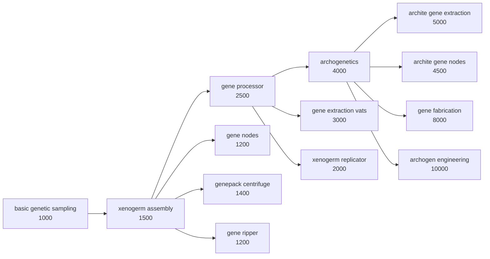

# Rebalance Patches — Patch Documentation

> **⚠ Keep this document up to date: every time a patch is added, removed or meaningfully changed, update this file (and CHANGELOG.md) in the same commit.**
> **Style: one short paragraph per feature that says what is patched and why in the same breath — written so a player can tell what the mod offers at a glance. Technical notes only where a maintainer needs them (ordering constraints, guards, C# hooks).**

---

## Standalone patches

### RimIOT - Logistic Matrix

Affects: **RimIOT - Logistic Matrix** (`CN.RimIOT`) — folder `1.6/RimIOT`.

- **Cheaper builds** (`rimiot.costs`) — Cable, input connector and interface cost a little steel and industrial components instead of advanced ones. Passive logistics infrastructure shouldn't be an endgame investment.
- **No power consumption** (`rimiot.power`) — Network buildings draw no power and need no wiring: power, flickable and network-draw comps are stripped, and the building descriptions are rewritten without the power notes. Storage logistics just works in the background.

### Altered Carbon

Affects: **Altered Carbon** (`hlx.UltratechAlteredCarbon`) + **Vanilla Apparel Expanded — Accessories** (`VanillaExpanded.VAEAccessories`) — folder `1.6/AlteredCarbon`.

- **Disable VAE ranged shield belt** (`altered.shieldbelt`) — The VAE Accessories ranged shield belt is a cheaper duplicate of Altered Carbon's cuirassier belt, so it becomes uncraftable, untradeable and unspawnable; the harder-to-get AC version stays meaningful. The def is kept, so saves are unaffected. Guarded: no-op without VAE Accessories.
- **Casting relay range slider** (`altered.relayrange`, toggle + slider 1–25, default 10) — Choose how many world tiles of needlecasting range each powered casting relay adds; AC's fixed 5 is too short to matter on a real world map. Toggle off to keep AC's own behaviour.
  *Maintainer note:* the range is hardcoded in `Building_NeuralMatrix.NeedleCastRange()`. The slider value is injected into `AC_CastingRelay` as a `RebalancePatches.CastingRelayRangeExtension` (plus rewritten description) by the `FromSetting` ops, and read by an error-safe, reflection-based Harmony postfix in `Source/RebalancePatches/Mods/AlteredCarbon/AlteredCarbonPatches.cs`. No extension → 5/relay, so custom relay defs (e.g. a malfunctioning range-1 scenario relay) can carry their own value.

### GiTS Cyberbrains

Affects: **GiTS: Cyberbrains** (`moistestWhale.gitsCyberbrains`) + optionally **EPOE-Forked** (`vat.epoeforked`) and **VE Achievements** (`vanillaexpanded.achievements`) — folder `1.6/GiTS`.

- **Only basic cyberbrains sold** (`gits.merchant`) — Traders no longer stock the enhanced/specialized/advanced/extreme tiers, so buying a top-tier brain can't skip the progression. They stay craftable and can spawn on raiders.
- **Harsher extreme mental break** (`gits.mentalbreak`) — PX-7 and HADES mental break threshold offset +20% → +40% (descriptions updated); the ultimate cyberbrains get a downside that actually matters.
- **Streamlined research tree** (`gits.research`) — The three nanite surgery researches collapse into nanite grafting and the empty filler nodes are deleted, prerequisites rewired; no more one-recipe padding nodes.
- **Surgeries via EPOE, ultratech tiers** (`gits.surgeries`) — Cyberbrain install/removal surgeries unlock with EPOE-Forked's brain surgery and post-basic cyberization researches move to ultratech, integrating GiTS into the EPOE surgery progression and pushing the crazy tiers to endgame. Requires EPOE-Forked (guarded on its BrainSurgery research); a VE Achievements tracker is retargeted if present.
  *Maintainer note:* **must stay after `gits.research` in the file** — it deletes a node the other feature still edits.

### Odyssey

Affects: **Odyssey** (`Ludeon.RimWorld.Odyssey`) — folder `1.6/Odyssey`.

- **Long-range passenger shuttle** (`odyssey.shuttle`) — Chemfuel capacity 400 → 2000 (default target fuel raised to match) and cargo mass capacity 500 → 2000. At 3 fuel per tile the stock shuttle barely leaves the neighbourhood; now it has a ~666-tile reach and a hold worth loading.

---

## Genetics Research Overhaul

A cohesive rework of genetics research, inspired by **Progression: Genetics** (`ferny.progressiongenetics`) but rebuilt from scratch without the Vanilla Genetics Expanded dependency, and extended with late-game genetics mods. Vanilla puts a full gene-editing empire behind two cheap industrial researches; this stages it and gives every genetics mod a common backbone to hook into. Requires **Biotech**. Group toggle `genetics`; every module below has its own toggle and silently no-ops if the core module or its target mod is missing.

### The tree

All projects sit on a new **Genetics** research tab, at spacer tech, on the hi-tech research bench. Costs escalate down the tree.

### Core tree (`genetics.core`)

Affects: **Biotech** (`Ludeon.RimWorld.Biotech`) — folder `1.6/Biotech`.

Injects the Genetics tab rooted on a new *basic genetic sampling* project (gene extractor and gene bank unlock there), renames Xenogermination to *xenogerm assembly* (gene assembler), and moves gene processor and archogenetics onto the tab with raised costs. The `GeneBuildingBase` prerequisite is replaced (not removed) so third-party gene buildings inheriting it default to sampling.

### ReSplice: Core (`genetics.resplice`)

Affects: **ReSplice: Core** (`ReSplice.XOTR.Core`) — folder `1.6/ReSplice`.

The gene centrifuge and xenogerm duplicator no longer piggyback on gene processor: each becomes a deliberate unlock behind new *genepack centrifuge* (after xenogerm assembly) and *xenogerm replicator* (after gene processor) projects, renamed to match.

### Gene Extractor Tiers (`genetics.extractortiers`)

Affects: **Gene Extractor Tiers** (`RedMattis.GeneExtractor`) — folder `1.6/GeneExtractorTiers`.

The vats trivialised extraction the moment xenogenetics finished; now the gene extraction vat is a mid-tree unlock (*gene extraction vats*, after gene processor) and the two archite vats a late one (*archite gene extraction*, after archogenetics, multianalyzer).

### Gene nodes (`genetics.genenodes`)

Affects: **Gene Extractor Tiers** (`RedMattis.GeneExtractor`) + **Gene Nodes - Genes for Sale** (`RedMattis.GeneNodes`) — folders `1.6/GeneExtractorTiers` and `1.6/GeneNodes`.

Base gene nodes get their own *gene nodes* project (after xenogerm assembly); archite node libraries are effectively free archite genes, so all archite nodes — including the premium Ageless/Sanguophage tier — move behind *archite gene nodes* (after archogenetics) with real prices (more components, archite capsules, silver). Patched via the abstract bases so every node from both mods inherits the change.

### Gene Ripper (`genetics.generipper`)

Affects: **Gene Ripper** (`defi.generipper`, legacy `DanielWedemeyer.GeneRipper`) — folder `1.6/GeneRipper`.

A kill-to-extract machine shouldn't share the plain extractor's unlock: it moves behind a new *gene ripper* project (after xenogerm assembly). Wording taken from Progression: Genetics.

### Gene Fabrication (`genetics.genefab`)

Affects: **Gene Fabrication** (`AmCh.Eragon.HCGeneFabrication`) — folder `1.6/GeneFabrication`.

Fabricating genes from neutroamine is an end-of-tree power, not a gene-processor side grab: the research moves to the Genetics tab as an archogenetics capstone (cost 8000). Note: the mod C#-generates one genepack recipe per gene and hardcodes archite recipes to archogenetics — the ~50 recipes under archogenetics come from it.

### VQE Ancients archogen lab (`genetics.vqea`)

Affects: **Vanilla Quests Expanded - Ancients** (`vanillaquestsexpanded.ancients`) — folder `1.6/VQEAncients`.

A new *archogen engineering* capstone (10000, multianalyzer) makes the archogen injector and its 12 linkable lab facilities buildable at archite-tier costs and work amounts — raiding ancient vaults stays the shortcut, research the long road.

### Alpha Genes quest flavour (`genetics.alphagenes`)

Affects: **Alpha Genes** (`sarg.alphagenes`) — folder `1.6/AlphaGenes`.

Renames the abandoned biotech lab quest/site to xenogenetics-lab flavour matching the overhauled genetics theme (rules copied from Progression: Genetics). Works without `genetics.core`.

---

## Conventions (how patches are built)

Read the `rebalance-patches` skill before editing; short version:

1. **Two-layer gating.** Mod presence → conditional folder in `LoadFolders.xml` (`IfModActive`); user choice → every feature wrapped in `RebalancePatches.PatchOperationIfEnabled` with its `settingKey`. Never `MayRequire` on an `<Operation>` (silently ignored).
2. **Patch files apply in REVERSE of the LoadFolders.xml listing** (`foldersToLoadDescendingOrder` is built back-to-front). A folder whose patches must run first (e.g. `1.6/Biotech` creating the Genetics tab) must be listed **last**. Getting this wrong doesn't error — dependent features just silently no-op.
3. **Cross-feature guards.** A feature that depends on another feature's output wraps its ops in a match-only `PatchOperationConditional` testing a def that feature creates (e.g. `Defs/ResearchTabDef[defName="RBP_GeneticsTab"]`). Missing dependency → clean no-op, no log spam.
4. **Injecting defs from a patch.** All def XML is merged into one document before patching, so `PatchOperationAdd` with xpath `Defs` appends whole new defs — and stays toggleable, unlike defs shipped as loose files.
5. **Inheritance.** Child list nodes MERGE with an abstract parent's list; when re-gating something that inherits, write the replacement with `Inherit="False"`. Patching an abstract base (by `@Name`) reaches every child from every mod.
6. **`PatchOperationSequence` aborts on first failure** — only use it inside a guard that proves all targets exist.
7. Settings are registered in `Source/RebalancePatches/SettingsRegistry.cs` (group + child toggles, all default on). Rebuild with `dotnet build Source/RebalancePatches/RebalancePatches.csproj -c Release`.
8. **XML-declared defaults.** `PatchOperationIfEnabled` accepts an optional `<defaultOn>false</defaultOn>`; it registers via `SettingsRegistry.RegisterXmlDefault` and wins over the C# default for both the effective value and the UI checkbox. This is how future big overhauls ship off by default without touching C#.
9. **Numeric settings.** A `RebalanceSlider` on a group declares an int setting with its own on/off toggle sharing the same key (checkbox on the slider row). `RebalancePatches.PatchOperationAddFromSetting` / `...ReplaceFromSetting` (fields `settingKey`/`xpath`/`value`) substitute `{value}` in the value's text nodes with the effective int before applying. Wrap them in a `PatchOperationIfEnabled` keyed to the slider key so toggling it off skips the patch entirely. Values are stored only when ≠ default (revert arrow in the UI).
10. **Harmony (since 1.2.0).** The mod depends on `brrainz.harmony` (Lib.Harmony nuget with `ExcludeAssets="runtime"`, DLL not shipped). Root `HarmonyInit.cs` calls one `TryApply(harmony)` per target mod; mod-specific C# lives under `Source/RebalancePatches/Mods/<Mod>/` (namespace `RebalancePatches.Mods.<Mod>`, but DefModExtensions referenced from XML stay in the flat `RebalancePatches` namespace). Every apply is gated on `ModsConfig.IsActive`, uses reflection instead of compile-time refs to the target mod, and wraps both the apply and the patch body in try/catch so failure degrades to the target mod's own behaviour.

### Checklist for adding a new patch

1. Add the toggle, slider or group in `SettingsRegistry.cs`; rebuild the DLL.
2. Create `1.6/<Mod>/Patches/<Mod>.xml` with `PatchOperationIfEnabled` + guards; unique file name.
3. Add the `IfModActive` entry in `LoadFolders.xml` — mind the reverse ordering rule.
4. Add the packageId to `loadAfter` in `About.xml`; update its description if user-facing.
5. Any C# for the mod goes in `Source/RebalancePatches/Mods/<Mod>/`; Harmony patches follow rule 10.
6. Verify in-game: clean log with the mod present, absent, and with the toggle off.
7. **Update this document, CHANGELOG.md and the workshop description.**
