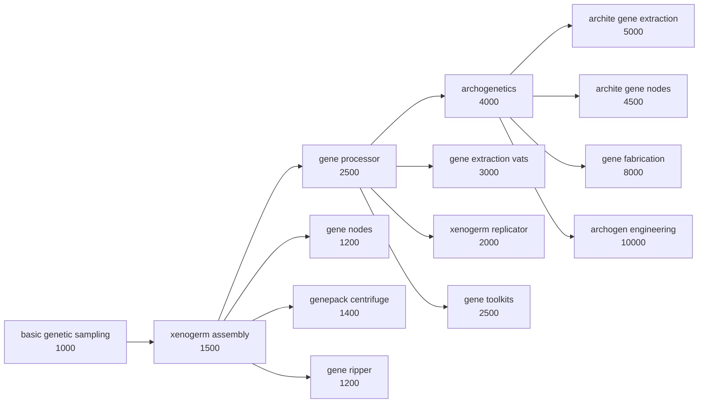

# Rebalance Patches — Patch Documentation

> **⚠ Keep this document up to date: every time a patch is added, removed or meaningfully changed, update this file (and CHANGELOG.md) in the same commit.**
> **Style: one short paragraph per feature that says what is patched and why in the same breath — written so a player can tell what the mod offers at a glance. Technical notes only where a maintainer needs them (ordering constraints, guards, C# hooks).**

---

## Patches

### RimIOT - Logistic Matrix

Affects: **RimIOT - Logistic Matrix** (`CN.RimIOT`) — folder `1.6/RimIOT`.

- **Cheaper builds** (`rimiot.costs`) — Cable, input connector and interface cost a little steel and industrial components instead of advanced ones. Passive logistics infrastructure shouldn't be an endgame investment.
- **No power consumption** (`rimiot.power`) — Network buildings draw no power and need no wiring: power, flickable and network-draw comps are stripped, and the building descriptions are rewritten without the power notes. Storage logistics just works in the background.

### Altered Carbon

Affects: **Altered Carbon** (`hlx.UltratechAlteredCarbon`) + **Vanilla Apparel Expanded — Accessories** (`VanillaExpanded.VAEAccessories`) — folder `1.6/AlteredCarbon`.

- **Disable VAE ranged shield belt** (`altered.shieldbelt`) — The VAE Accessories ranged shield belt is a cheaper duplicate of Altered Carbon's cuirassier belt, so it becomes uncraftable, untradeable and unspawnable; the harder-to-get AC version stays meaningful. The def is kept, so saves are unaffected. Guarded: no-op without VAE Accessories.
- **Casting relay range slider** (`altered.relayrange`, toggle + slider 1–25, default 10) — Choose how many world tiles of needlecasting range each powered casting relay adds; AC's fixed 5 is too short to matter on a real world map. Toggle off to keep AC's own behaviour.
  *Maintainer note:* the range is hardcoded in `Building_NeuralMatrix.NeedleCastRange()`. The slider value is injected into `AC_CastingRelay` as a `RebalancePatches.CastingRelayRangeExtension` (plus rewritten description) by the `FromSetting` ops, and read by an error-safe, reflection-based Harmony postfix in `Source/RebalancePatches/Mods/AlteredCarbon/AlteredCarbonPatches.cs`. No extension → 5/relay, so custom relay defs (e.g. a malfunctioning range-1 scenario relay) can carry their own value.
- **Advanced shields need Fabrication** (`altered.shieldsfab`) — `AC_AdvancedShieldBelt` research additionally requires Fabrication; its gear is fabrication-bench only anyway.
- **Cuirassier belt on vanilla shields** (`altered.cuirassier`) — The cuirassier belt swaps VEF's shield bubble for vanilla `CompProperties_Shield` (max energy 1.2, recharge 0.13): quality scaling, doesn't block outgoing shots.
- **Neural editor trait blacklist** (`altered.traitblacklist`) — `StackSavingOptions/ignoresTraits` gains body-bound traits from Hauts' Added Traits, The Sims Traits and VTE (per-entry MayRequire) so they don't carry between sleeves (`AlteredCarbonTraitBlacklist.xml`).
- **Sleeve quality cancer rates fixed** (`altered.sleevecancer`) — Good→legendary sleeve quality genes multiplied CancerRate by *negative* numbers (-0.1…-0.5), inverting the stat; now proper factors 0.9/0.8/0.7/0.5 (awful/poor ×5/×2.5 kept).

### GiTS Cyberbrains

Affects: **GiTS: Cyberbrains** (`moistestWhale.gitsCyberbrains`) + optionally **EPOE-Forked** (`vat.epoeforked`) and **VE Achievements** (`vanillaexpanded.achievements`) — folder `1.6/GiTS`.

- **Only basic cyberbrains sold** (`gits.merchant`) — Traders no longer stock the enhanced/specialized/advanced/extreme tiers, so buying a top-tier brain can't skip the progression. They stay craftable and can spawn on raiders.
- **Harsher extreme mental break** (`gits.mentalbreak`) — PX-7 and HADES mental break threshold offset +20% → +40% (descriptions updated); the ultimate cyberbrains get a downside that actually matters.
- **Streamlined research tree** (`gits.research`) — The three nanite surgery researches collapse into nanite grafting and the empty filler nodes are deleted, prerequisites rewired; no more one-recipe padding nodes.
- **Surgeries via EPOE, ultratech tiers** (`gits.surgeries`) — Cyberbrain install/removal surgeries unlock with EPOE-Forked's brain surgery and post-basic cyberization researches move to ultratech, integrating GiTS into the EPOE surgery progression and pushing the crazy tiers to endgame. Requires EPOE-Forked (guarded on its BrainSurgery research); a VE Achievements tracker is retargeted if present.
  *Maintainer note:* **must stay after `gits.research` in the file** — it deletes a node the other feature still edits.

### Odyssey

Affects: **Odyssey** (`Ludeon.RimWorld.Odyssey`) — folder `1.6/Odyssey`.

- **Long-range passenger shuttle** (`odyssey.shuttle`) — Chemfuel capacity 400 → 2000 (default target fuel raised to match) and cargo mass capacity 500 → 2000. At 3 fuel per tile the stock shuttle barely leaves the neighbourhood; now it has a ~666-tile reach and a hold worth loading.

- **Vacuum resistance trims on modded armor** (`odyssey.vacuumtrims`) — Gated on **Vanilla Gravship Expanded - Chapter 1** (`vanillaexpanded.gravship`), whose balance assumes 100% vacuum resistance is hard to reach; modded spacer armor hands it out freely. Trims (each block only when its mod is loaded, via the mod's own patch folder): Rimsenal - Core helmets (Strikesuit/Assault/FS/Close Combat/Dropsuit) 0.67–0.69 → 0.61, Strikesuit/Dropsuit bodies 0.35/0.4 → 0.31, Reflactor helmet 0.68 → 0.65, plus two description touch-ups (Dropsuit helmet stops claiming EVA primacy, Hazard Carapace helmet advertises the vacuum niche it keeps at 0.7); Rimsenal - Federation marksman gear helmet 0.65 → 0.59; Altered Carbon 2 chrysalis-tier helmets 0.67 → 0.62; Spacer Arsenal ensign helmet 0.69 → 0.65 (sharp armor 0.86 → 0.80); Impact Weaponry - Reloaded crusader helmets 0.69 → 0.67 (sharp armor 1.3 → 1.10). Ported from TMM's equipment rebalance; TSF block skipped (mod not run) and TMM's stale `Apparel_Shocksuit` entry dropped (no such def in Rimsenal Core 1.6).

### Gene conflict fixes (`geneconflicts.*`)

Genes whose forced traits fight each other or whose effects stack brokenly become mutually exclusive via `exclusionTags` (reusing a mod's own tag where one exists):

- **`geneconflicts.bloodlust`** — B&S `BS_Bloodlust` × VRE-Highmate `VRE_Distressed` (tag `RBP_BloodlustDistressed`).
- **`geneconflicts.psychic`** — WVC's own sensitivity tags added to vanilla `PsychicAbility_Dull`/`Deaf`.
- **`geneconflicts.firefoam`** — WVC `WVC_FirefoampopMech` (suppresses Pyromaniac) × AG `AG_FireObsession` (forces it), tag `RBP_FirefoamPyromaniac`.
- **`geneconflicts.hemogen`** — VRE-Sanguophage's `HemogenDrain` tag extended to vanilla `HemogenDrain`, B&S `VU_GreaterHemogenDrain`, WVC `WVC_HemogenGain`.
- **`geneconflicts.deathless`** — tag `RBP_Deathless` on vanilla `Deathless`, B&S `BS_ReturningSoul`/`BS_Immortal`, WVC `WVC_Undead`/`WVC_NeverDead`, VRE-Archon `VRE_Transcendent`. B&S lesser/greater deathlessness are excluded — they *require* Deathless.
- **`geneconflicts.dodge`** — VRE-Lycanthrope's `MeleeDodge` tag on `VQEA_Prowess`, Harana `AgileStriker`, Askbarn `RSLightningReflexes`/`RSBornWarrior`, Keshig `DV_DodgeChance_High`/`Low`, Highborn `HBX_Fencer`.

### Alpha Genes genepacks (`alphagenes.genepacks`)

AG hides its genes from vanilla genepacks via `selectionWeight 0`; the patch rescales them (1 default, 0.5 mechanitor/tails, 0.2 wings, 0.02 cosmetics) so AG genes spawn in vanilla genepacks at sane rates. Alphapacks/mixedpacks become unobtainable (`thingSetMakerTags` removed, `tradeability None` — existing ones keep working), and the `AG_RandomGenepack` quest spawner yields vanilla genepacks only.

### Big and Small / VFE / VRE

- **`bigsmall.madscience`** — `BS_MadScienceField` research gains the Gun turrets prerequisite; Gun turrets is removed from the turrets and ray weapons it unlocks.
- **`bigsmall.geneintegrator`** — The gene integrator (`BS_GeneGeneIntegrator`, turns all xenogenes into endogenes — freeing the slots to stack more) moves from `BS_GeneScience` to `BS_ArchiteGeneScience` + `Archogenetics`, its costList becomes 1 archite capsule + 2 ultratech medicine + 2 advanced components + 20 neutroamine, and it gets an explicit 4000 market value (was priced off ~350 of ingredients). Guarded on the def — B&S only ships it alongside a content mod.
- **`vfepirates.chargeweapons`** — Charge lance/blaster boxes require `ChargedShot` + spacer warcasket weaponry (`Inherit="False"`); with Coilguns the railgun box needs Mass Drivers + spacer. With Warcasket Weapon Quality (which retires the boxes for direct recipes) the same gates are added onto its recipes — needs our mod to load after it (`loadAfter`).
- **`vfepirates.empirescenario`** — Empire gains `VFEP_PlayerPirate` in `permanentEnemyToEveryoneExcept`, so the Low orbit crash scenario's reputation is repairable (Royalty).
- **`vfeempire.qol`** — Royal armchair counts for Stellarch/High Stellarch throne rooms; VFuE candelabra shows its glow radius when placing.
- **`vreinsector.colossalweapons`** — `forcedTraits BS_Giant` on the Colossal `GenelineGeneDef` (VFE-Insectoids 2 + B&S), enabling B&S giant weapons.

### Rimsenal

- **`rimsenal.armortechs`** — Armor recipes move from Recon/Marine/Powered armor to the corp techs: Greydale sets (incl. Medic/Pioneer/Nomad, which had none) → `DefenceTech`, Yeonhwa suits → `ShardTech`, Jotun → `MoltenTech`, Tesseron → `KineticTech`, Korp → `SiegeTech` (its malformed `<il>` prerequisite repaired).
- **`rimsenal.modularweapons`** — Modular carbine + MRS conversion kit + MBPS armor kit → `DefenceTech`; GD multi launcher → Mortars + `DefenceTech` (the singular `DefenceTech` inherited from `BaseGDGun` remains — the game enforces singular and list together).
- **`rimsenal.corpcost`** — Kinetic/Molten/Shard tier-1 corp techs cost 3000.
- **`rimsenalspacer.caravanmechs`** — `SpacerCivil`/`SpacerRough` trader caravans lose their `Mech_Tagmaton`/`Skutaton`/`Psiloid` guards (broken caravan generation).
- **`rimsenalspacer.smartweapons`** — Smart charge rifle/lance/minigun drop the inherited gunsmithing prerequisite (empty override); smart visor unlocks from Gunlink, renamed *smart targeting systems*.

### Memes, xenotypes & inspirations

- **Inspirations respect precepts** (`memes.inspirations`) — Port of TMM's InspirationExtension: `RebalancePatches.InspirationNullifyingExtension` lists `nullifyingPrecepts` per `InspirationDef`; a postfix on `InspirationWorker.InspirationCanOccur` (Ideology only) blocks the roll when the pawn's ideology has one. Applied to vanilla Frenzy_Shoot and Inspired_Taming (`1.6/Core` — always loaded, targets vanilla defs) and to six VSIE inspirations (`1.6/VSIE`), with per-precept MayRequire on VIE - Memes and Structures, Alpha Memes and Ideology. TMM's Inspired_Recruitment entry dropped (needs VFE - Ancients, not in the modlist); its JoyKind/VTE sibling was already dropped with VTE support.
- **`memes.factions`** — Rimsenal Spacer and Federation factions disallow Alpha Memes' vow of nonviolence (breaks their combat pawns). Needs VIE - Memes and Structures.
- **`memes.anomalytraits`** — Occultist trait and void fascination agree with the Inhuman and Ritualist memes (Anomaly + VIE M&S).
- **`xenotypes.factions`** — Odyssey's Salvagers gain Zohar/Askbarn/Uredd/Harana/Venator/Keshig/Fleetkind, Traders guild gains Fleetkind; WVC's Mechakin/Rogueformer/Genethrower move to Rimsenal Spacer factions.
- **`xenotypes.wvcchances`** — WVC's Featherdust/Cat deity/Blank/Sandycat/Undead leave generic vanilla factions; Undead + Sandycat join the Horax cult (Anomaly).

### Integrated Implants

- **`implants.chipbad`** — `isBad=false` on the skill chip hediff base (EBSG-gated) so healer serums and biosculpting don't purge them.
- **`implants.chiptiers`** — Mechhive satellite uplink / mechwomb / warprogrammer interface / remote dominator cost Alpha Mechs' `AM_HyperLinkageChip`/`AM_StellarProcessingChip`/`AM_QuantumMatrixChip` instead of vanilla tier 2-3 chips.
- **`implants.voicelockmasochist`** — `LTS_ActiveVoicelock` (-8) is nullified by Masochist; new `RBP_MasochistVoicelocked` thought gives +8 instead.
- **`implants.shoulderslimes`** — The toggle abilities' `ToggleHediff` location moves Torso → Shoulder, which slime bodies actually have (B&S Slimes error fix).
- **Levitating implants ignore water** (`implants.waterpathing`) — A postfix on `Pawn.WaterCellCost` returns cost 1 for pawns with the `PsychicLevitator` or `LTS_Gravlifter` hediff, so the pathfinder treats water as open ground for them (port of TMM's WaterCellCostPatch).
- **Signal boosters stack with AG command range genes** (`implants.boosterrange`) — Alpha Genes' increased/decreased command range genes postfix `Pawn_MechanitorTracker.CanCommandTo` with a hard 35/15-tile radius, discarding II's `MechRemoteControlDistanceOffset` stat. A `Priority.Last` postfix recomputes the radius as the gene's base plus the stat, and draws the combined ring. Needs both mods; our own fix, not from TMM.

### Weapons & apparel

- **`vse.reloadingstat`** — Gunner expertise offsets vanilla `RangedCooldownFactor` (-0.025/level) instead of VEF's hidden verb cooldown stat, so it shows on weapon cards.
- **`impactweaponry.bolterprereq`** — Warcasket impact bolter box → `Inherit="False"` spacer warcasket weaponry + impact shot (drops the redundant extra).
- **`spacerarsenal.prereqs`** — With VWE: brute rifle, clash HMG/rifle, contact/thump grenades → Heavy Weapons + Fabrication; with Coilguns: coil lance + sparksabre → Mass Drivers.
- **`eltex.spawns`** — Eltex weapons get `PsychicGun`/`PsychicMelee`/`Bladelink` tags: off random raiders, onto Empire cataphracts, VPE Empire psycasters and VFEE deserters (Royalty).
- **`alphamemes.vacstonetiles`** — Jewish/kemetic/steampunk/neolithic/ocular styled tiles buildable from Odyssey's vacstone blocks (new TerrainDefs).

### Vanilla & DLC

- **`vanilla.healingenhancer`** — The Royalty healing enhancer swaps the hidden `naturalHealingFactor` for `statFactors/InjuryHealingFactor` ×1.5, visible on the pawn's stat card.
- **`vanilla.mechraidgroups`** — Combined mechanoid raid compositions (melee/light/heavy/all-star + bomb rush) mixing vanilla, Alpha Mechs and Rimsenal Spacer mechs, per-entry MayRequire (`Biotech/Patches/MechRaidGroups.xml`).
- **`vanilla.toxicmeat`** — VAE Waste's toxic meat disallowed by default in hopper storage and `CookMealBase` ingredient filters.
- **`vanilla.creepjoinersurgery`** — Every RecipeDef listing Human in `recipeUsers` but not CreepJoiner gains CreepJoiner, so creep joiners accept modded implants and prosthetics (Anomaly).
- **Gene complexity sliders** (`vanilla.genecomplexitybase`, `vanilla.genecomplexityprocessor`) — The base slider adds a flat offset (default +10) to `Building_GeneAssembler.MaxComplexity()`'s hardcoded 6 via a postfix; the processor slider rewrites `GeneProcessor`'s `GeneticComplexityIncrease` stat (default 3, vanilla 2) via the settings-substituting patch op. Toggling either off keeps the vanilla value.

### VQE Ancients

- **`vqea.sittable`** — Ancient hospital armchair + bench become real seats (`isSittable`, Chair replace tags) using the comfort they already had.
- **`vqea.giantweapons`** — Enormous and Herculean archite genes force B&S's `BS_Giant` trait, enabling giant weapons (same mechanism as `BS_GiantWeaponWielder`).
- **`vqea.patientgown`** — Patient gown blunt armor 0.5 → 0.1, so pawns stop preferring it over armor.
- **Archogen injector whitelist** (`vqea.injectorwhitelist`) — The archogen injector and ancient-experiment pawn generation pick from *every* loaded archite gene and negative metabolism gene (`Utils.IsValidGeneForInjection` is blacklist-based) — with a large modlist that pool is absurd and includes run-ruining drawbacks. Port of TMM's whitelist: `RebalancePatches.ArchogenWhitelistDef` (`RBP_ArchogenInjectionWhitelist`, in the VQEAncients folder) lists VQEA's own archite powers plus curated mild drawbacks (vanilla, AG, B&S, WVC, VRE, Det's — per-entry MayRequire); a prefix makes `IsValidGeneForInjection` whitelist-only when such a def exists. TMM's entries for RimElves, Rooboid, Satyr and Tenmo dropped (mods not installed). Note: all VQEA genes are `biostatArc 1`, so "keep them out of vanilla genepacks" needed no patch — vanilla genepacks never roll archite genes.

---

## Genetics Research Overhaul

A cohesive rework of genetics research, inspired by **Progression: Genetics** (`ferny.progressiongenetics`) but rebuilt from scratch without the Vanilla Genetics Expanded dependency, and extended with late-game genetics mods. Vanilla puts a full gene-editing empire behind two cheap industrial researches; this stages it and gives every genetics mod a common backbone to hook into. Requires **Biotech**. Group toggle `genetics`; every module below has its own toggle and silently no-ops if the core module or its target mod is missing.

### The tree

All projects sit on a new **Genetics** research tab, at spacer tech, on the hi-tech research bench. Costs escalate down the tree.

### Core tree (`genetics.core`)

Affects: **Biotech** (`Ludeon.RimWorld.Biotech`) — folder `1.6/Biotech`.

Injects the Genetics tab rooted on a new *basic genetic sampling* project (gene extractor and gene bank unlock there), renames Xenogermination to *xenogerm assembly* (gene assembler), and moves gene processor and archogenetics onto the tab with raised costs. The `GeneBuildingBase` prerequisite is replaced (not removed) so third-party gene buildings inheriting it default to sampling.

### ReSplice: Core (`genetics.resplice`)

Affects: **ReSplice: Core** (`ReSplice.XOTR.Core`) — folder `1.6/ReSplice`.

The gene centrifuge and xenogerm duplicator no longer piggyback on gene processor: each becomes a deliberate unlock behind new *genepack centrifuge* (after xenogerm assembly) and *xenogerm replicator* (after gene processor) projects, renamed to match.

### Gene Extractor Tiers (`genetics.extractortiers`)

Affects: **Gene Extractor Tiers** (`RedMattis.GeneExtractor`) — folder `1.6/GeneExtractorTiers`.

The vats trivialised extraction the moment xenogenetics finished; now the gene extraction vat is a mid-tree unlock (*gene extraction vats*, after gene processor) and the two archite vats a late one (*archite gene extraction*, after archogenetics, multianalyzer).

### Gene nodes (`genetics.genenodes`)

Affects: **Gene Extractor Tiers** (`RedMattis.GeneExtractor`) + **Gene Nodes - Genes for Sale** (`RedMattis.GeneNodes`) — folders `1.6/GeneExtractorTiers` and `1.6/GeneNodes`.

Base gene nodes get their own *gene nodes* project (after xenogerm assembly); archite node libraries are effectively free archite genes, so all archite nodes — including the premium Ageless/Sanguophage tier — move behind *archite gene nodes* (after archogenetics) with real prices (more components, archite capsules, silver). Patched via the abstract bases so every node from both mods inherits the change; nodes shipping their own discount costList (VIPER, Ageless, Sanguophage, the Big and Small soul nodes, AG Helixan) have it stripped so they fall back to the tier prices.

### Gene Ripper (`genetics.generipper`)

Affects: **Gene Ripper** (`defi.generipper`, legacy `DanielWedemeyer.GeneRipper`) — folder `1.6/GeneRipper`.

A kill-to-extract machine shouldn't share the plain extractor's unlock: it moves behind a new *gene ripper* project (after xenogerm assembly). Wording taken from Progression: Genetics.

### Gene Fabrication (`genetics.genefab`)

Affects: **Gene Fabrication** (`AmCh.Eragon.HCGeneFabrication`) — folder `1.6/GeneFabrication`.

Fabricating genes from neutroamine is an end-of-tree power, not a gene-processor side grab: the research moves to the Genetics tab as an archogenetics capstone (cost 8000). Note: the mod C#-generates one genepack recipe per gene and hardcodes archite recipes to archogenetics — the ~50 recipes under archogenetics come from it.

### VQE Ancients archogen lab (`genetics.vqea`)

Affects: **Vanilla Quests Expanded - Ancients** (`vanillaquestsexpanded.ancients`) — folder `1.6/VQEAncients`.

A new *archogen engineering* capstone (10000, multianalyzer) makes the archogen injector and its 12 linkable lab facilities buildable at archite-tier costs and work amounts — raiding ancient vaults stays the shortcut, research the long road.

### Alpha Genes gene toolkits (`genetics.agtools`)

Affects: **Alpha Genes** (`sarg.alphagenes`) — folder `1.6/AlphaGenes`.

AG's eleven single-use gene tools (gene remover, endo/xenogenefier, xenotype nullifier/injector, germline mutator, genepack tweaker/disruptor, plus the three archotech targeted variants) ship with no research and no recipes — trader stock and quest rewards only. A new *gene toolkits* project (2500, after gene processor) makes them all craftable at the fabrication bench: genepack tools 4 neutroamine + 1 component, single-gene tools 8 neutroamine + 2 components, whole-xenotype tools 12 neutroamine + 1 advanced component, archotech variants 12 neutroamine + 2 advanced components + 1 archite capsule (Crafting 8). Trade acquisition is untouched, and the archotech xenogenefier's market value is fixed from 100 to 500 to match its siblings. Own design — TMM never integrated these.

### Alpha Genes quest flavour (`genetics.alphagenes`)

Affects: **Alpha Genes** (`sarg.alphagenes`) — folder `1.6/AlphaGenes`.

Renames the abandoned biotech lab quest/site to xenogenetics-lab flavour matching the overhauled genetics theme (rules copied from Progression: Genetics). Works without `genetics.core`.

---

## Conventions (how patches are built)

Read the `rebalance-patches` skill before editing; short version:

1. **Two-layer gating.** Mod presence → conditional folder in `LoadFolders.xml` (`IfModActive`); user choice → every feature wrapped in `RebalancePatches.PatchOperationIfEnabled` with its `settingKey`. Never `MayRequire` on an `<Operation>` (silently ignored).
2. **Patch files apply in REVERSE of the LoadFolders.xml listing** (`foldersToLoadDescendingOrder` is built back-to-front). A folder whose patches must run first (e.g. `1.6/Biotech` creating the Genetics tab) must be listed **last**. Getting this wrong doesn't error — dependent features just silently no-op.
3. **Cross-feature guards.** A feature that depends on another feature's output wraps its ops in a match-only `PatchOperationConditional` testing a def that feature creates (e.g. `Defs/ResearchTabDef[defName="RBP_GeneticsTab"]`). Missing dependency → clean no-op, no log spam.
4. **Injecting defs from a patch.** All def XML is merged into one document before patching, so `PatchOperationAdd` with xpath `Defs` appends whole new defs — and stays toggleable, unlike defs shipped as loose files.
5. **Inheritance.** Child list nodes MERGE with an abstract parent's list; when re-gating something that inherits, write the replacement with `Inherit="False"`. Patching an abstract base (by `@Name`) reaches every child from every mod.
6. **`PatchOperationSequence` aborts on first failure** — only use it inside a guard that proves all targets exist.
7. Settings are registered in `Source/RebalancePatches/SettingsRegistry.cs` (group + child toggles, all default on). Rebuild with `dotnet build Source/RebalancePatches/RebalancePatches.csproj -c Release`.
8. **XML-declared defaults.** `PatchOperationIfEnabled` accepts an optional `<defaultOn>false</defaultOn>`; it registers via `SettingsRegistry.RegisterXmlDefault` and wins over the C# default for both the effective value and the UI checkbox. This is how future big overhauls ship off by default without touching C#.
9. **Numeric settings.** A `RebalanceSlider` on a group declares an int setting with its own on/off toggle sharing the same key (checkbox on the slider row). `RebalancePatches.PatchOperationAddFromSetting` / `...ReplaceFromSetting` (fields `settingKey`/`xpath`/`value`) substitute `{value}` in the value's text nodes with the effective int before applying. Wrap them in a `PatchOperationIfEnabled` keyed to the slider key so toggling it off skips the patch entirely. Values are stored only when ≠ default (revert arrow in the UI).
10. **Harmony.** The mod depends on `brrainz.harmony` (Lib.Harmony nuget with `ExcludeAssets="runtime"`, DLL not shipped). Root `HarmonyInit.cs` calls one `TryApply(harmony)` per target mod; mod-specific C# lives under `Source/RebalancePatches/Mods/<Mod>/` (namespace `RebalancePatches.Mods.<Mod>`, but DefModExtensions referenced from XML stay in the flat `RebalancePatches` namespace). Every apply is gated on `ModsConfig.IsActive`, uses reflection instead of compile-time refs to the target mod, and wraps both the apply and the patch body in try/catch so failure degrades to the target mod's own behaviour.

### Checklist for adding a new patch

1. Add the toggle, slider or group in `SettingsRegistry.cs`; rebuild the DLL.
2. Create `1.6/<Mod>/Patches/<Mod>.xml` with `PatchOperationIfEnabled` + guards; unique file name.
3. Add the `IfModActive` entry in `LoadFolders.xml` — mind the reverse ordering rule.
4. Add the packageId to `loadAfter` in `About.xml`; update its description if user-facing.
5. Any C# for the mod goes in `Source/RebalancePatches/Mods/<Mod>/`; Harmony patches follow rule 10.
6. Verify in-game: clean log with the mod present, absent, and with the toggle off.
7. **Update this document, CHANGELOG.md and the workshop description.**
